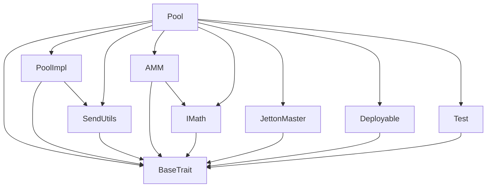
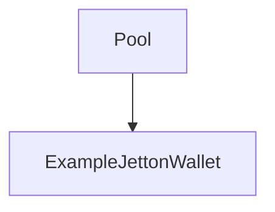

# TACT Compilation Report
Contract: Pool
BOC Size: 8155 bytes

# Types
Total Types: 30

## StateInit
TLB: `_ code:^cell data:^cell = StateInit`
Signature: `StateInit{code:^cell,data:^cell}`

## StdAddress
TLB: `_ workchain:int8 address:uint256 = StdAddress`
Signature: `StdAddress{workchain:int8,address:uint256}`

## VarAddress
TLB: `_ workchain:int32 address:^slice = VarAddress`
Signature: `VarAddress{workchain:int32,address:^slice}`

## Context
TLB: `_ bounced:bool sender:address value:int257 raw:^slice = Context`
Signature: `Context{bounced:bool,sender:address,value:int257,raw:^slice}`

## SendParameters
TLB: `_ bounce:bool to:address value:int257 mode:int257 body:Maybe ^cell code:Maybe ^cell data:Maybe ^cell = SendParameters`
Signature: `SendParameters{bounce:bool,to:address,value:int257,mode:int257,body:Maybe ^cell,code:Maybe ^cell,data:Maybe ^cell}`

## Deploy
TLB: `deploy#946a98b6 queryId:uint64 = Deploy`
Signature: `Deploy{queryId:uint64}`

## DeployOk
TLB: `deploy_ok#aff90f57 queryId:uint64 = DeployOk`
Signature: `DeployOk{queryId:uint64}`

## FactoryDeploy
TLB: `factory_deploy#6d0ff13b queryId:uint64 cashback:address = FactoryDeploy`
Signature: `FactoryDeploy{queryId:uint64,cashback:address}`

## JettonTransfer
TLB: `jetton_transfer#0f8a7ea5 query_id:uint64 amount:coins destination:address response_destination:address custom_payload:Maybe ^cell forward_ton_amount:coins forward_payload:remainder<slice> = JettonTransfer`
Signature: `JettonTransfer{query_id:uint64,amount:coins,destination:address,response_destination:address,custom_payload:Maybe ^cell,forward_ton_amount:coins,forward_payload:remainder<slice>}`

## JettonTransferNotification
TLB: `jetton_transfer_notification#7362d09c query_id:uint64 amount:coins sender:address forward_payload:remainder<slice> = JettonTransferNotification`
Signature: `JettonTransferNotification{query_id:uint64,amount:coins,sender:address,forward_payload:remainder<slice>}`

## JettonBurn
TLB: `jetton_burn#595f07bc query_id:uint64 amount:coins response_destination:address custom_payload:Maybe ^cell = JettonBurn`
Signature: `JettonBurn{query_id:uint64,amount:coins,response_destination:address,custom_payload:Maybe ^cell}`

## JettonExcesses
TLB: `jetton_excesses#d53276db query_id:uint64 = JettonExcesses`
Signature: `JettonExcesses{query_id:uint64}`

## JettonInternalTransfer
TLB: `jetton_internal_transfer#178d4519 query_id:uint64 amount:coins from:address response_address:address forward_ton_amount:coins forward_payload:remainder<slice> = JettonInternalTransfer`
Signature: `JettonInternalTransfer{query_id:uint64,amount:coins,from:address,response_address:address,forward_ton_amount:coins,forward_payload:remainder<slice>}`

## JettonBurnNotification
TLB: `jetton_burn_notification#7bdd97de query_id:uint64 amount:coins sender:address response_destination:address = JettonBurnNotification`
Signature: `JettonBurnNotification{query_id:uint64,amount:coins,sender:address,response_destination:address}`

## WalletData
TLB: `_ balance:coins owner:address jetton:address jetton_wallet_code:^cell = WalletData`
Signature: `WalletData{balance:coins,owner:address,jetton:address,jetton_wallet_code:^cell}`

## JettonData
TLB: `_ total_supply:coins mintable:bool admin_address:address jetton_content:^cell jetton_wallet_code:^cell = JettonData`
Signature: `JettonData{total_supply:coins,mintable:bool,admin_address:address,jetton_content:^cell,jetton_wallet_code:^cell}`

## JettonMint
TLB: `jetton_mint#89b71d09 origin:address receiver:address amount:int257 custom_payload:Maybe ^cell forward_ton_amount:coins forward_payload:remainder<slice> = JettonMint`
Signature: `JettonMint{origin:address,receiver:address,amount:int257,custom_payload:Maybe ^cell,forward_ton_amount:coins,forward_payload:remainder<slice>}`

## PoolParams
TLB: `_ initialA:int257 futureA:int257 initialTime:int257 futureTime:int257 = PoolParams`
Signature: `PoolParams{initialA:int257,futureA:int257,initialTime:int257,futureTime:int257}`

## AmountOut
TLB: `_ amountOut:coins feeIn:coins = AmountOut`
Signature: `AmountOut{amountOut:coins,feeIn:coins}`

## ExampleJettonWallet$Data
TLB: `null`
Signature: `null`

## PoolData
TLB: `_ reserve0:coins reserve1:coins token0Address:address token1Address:address lpFee:coins protocolFee:coins protocolFeeAddress:address collectedToken0ProtocolFee:coins collectedToken1ProtocolFee:coins = PoolData`
Signature: `PoolData{reserve0:coins,reserve1:coins,token0Address:address,token1Address:address,lpFee:coins,protocolFee:coins,protocolFeeAddress:address,collectedToken0ProtocolFee:coins,collectedToken1ProtocolFee:coins}`

## ExpectedLiquidity
TLB: `_ amount0:coins amount1:coins = ExpectedLiquidity`
Signature: `ExpectedLiquidity{amount0:coins,amount1:coins}`

## Reserves
TLB: `_ reserve0:coins reserve1:coins = Reserves`
Signature: `Reserves{reserve0:coins,reserve1:coins}`

## PayTo
TLB: `pay_to#c4605a58 owner:address tokenAAmount:coins walletTokenAAddress:address tokenBAmount:coins walletTokenBAddress:address = PayTo`
Signature: `PayTo{owner:address,tokenAAmount:coins,walletTokenAAddress:address,tokenBAmount:coins,walletTokenBAddress:address}`

## ProvideLiquidity
TLB: `provide_liquidity#355a3065 fromAddress:address jettonAmount0:coins jettonAmount1:coins minLPOut:coins = ProvideLiquidity`
Signature: `ProvideLiquidity{fromAddress:address,jettonAmount0:coins,jettonAmount1:coins,minLPOut:coins}`

## BurnNotification
TLB: `burn_notification#3d05c5ef fromAddress:address jettonAmount:coins responseAddress:address = BurnNotification`
Signature: `BurnNotification{fromAddress:address,jettonAmount:coins,responseAddress:address}`

## RefundMe
TLB: `refund_me#4813d803 tot_am0:int257 tot_am1:int257 user_address:address = RefundMe`
Signature: `RefundMe{tot_am0:int257,tot_am1:int257,user_address:address}`

## SetFees
TLB: `set_fees#54c370f0 newLPFee:coins newProtocolFees:coins newProtocolFeeAddress:address = SetFees`
Signature: `SetFees{newLPFee:coins,newProtocolFees:coins,newProtocolFeeAddress:address}`

## Swap
TLB: `swap#394a53a6 fromAddress:address jettonAmount:coins tokenWallet:address toAddress:address minOutput:coins = Swap`
Signature: `Swap{fromAddress:address,jettonAmount:coins,tokenWallet:address,toAddress:address,minOutput:coins}`

## Pool$Data
TLB: `null`
Signature: `null`

# Get Methods
Total Get Methods: 15

## get_pool_data

## getAmountOut
Argument: tokenIn
Argument: sender
Argument: amountIn

## getTokenOut
Argument: amount0
Argument: amount1

## get_expected_liquidity
Argument: amount

## get_reserve0

## get_reserve1

## getReserves

## getter_A

## getter_oldInvariant

## getter_newInvariant
Argument: amount0
Argument: amount1

## getter_computeDFromAdjustedBalances
Argument: xp0
Argument: xp1

## getter_ADD_NONE

## get_jetton_data

## get_wallet_address
Argument: owner_address

## get_test

# Error Codes
2: Stack underflow
3: Stack overflow
4: Integer overflow
5: Integer out of expected range
6: Invalid opcode
7: Type check error
8: Cell overflow
9: Cell underflow
10: Dictionary error
11: 'Unknown' error
12: Fatal error
13: Out of gas error
14: Virtualization error
32: Action list is invalid
33: Action list is too long
34: Action is invalid or not supported
35: Invalid source address in outbound message
36: Invalid destination address in outbound message
37: Not enough TON
38: Not enough extra-currencies
39: Outbound message does not fit into a cell after rewriting
40: Cannot process a message
41: Library reference is null
42: Library change action error
43: Exceeded maximum number of cells in the library or the maximum depth of the Merkle tree
50: Account state size exceeded limits
128: Null reference exception
129: Invalid serialization prefix
130: Invalid incoming message
131: Constraints error
132: Access denied
133: Contract stopped
134: Invalid argument
135: Code of a contract was not found
136: Invalid address
137: Masterchain support is not enabled for this contract
2296: JettonWallet: Only Jetton master or Jetton wallet can call this function
9739: Sender is not a Jetton wallet
13105: JettonWallet: Not enough jettons to transfer
27831: Only owner can call this function
29133: JettonWallet: Not allow negative balance after internal transfer
30061: JettonMaster: Jetton is not mintable
37185: Not enough funds to transfer
43365: JettonMaster: Sender is not a Jetton owner
46438: Pool: No fees to collect
47048: JettonWallet: Only owner can burn tokens
60354: JettonWallet: Not enough balance to burn tokens

# Trait Inheritance Diagram

# Contract Dependency Diagram

